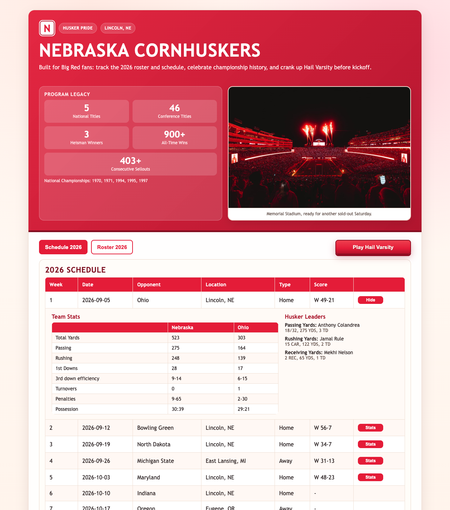
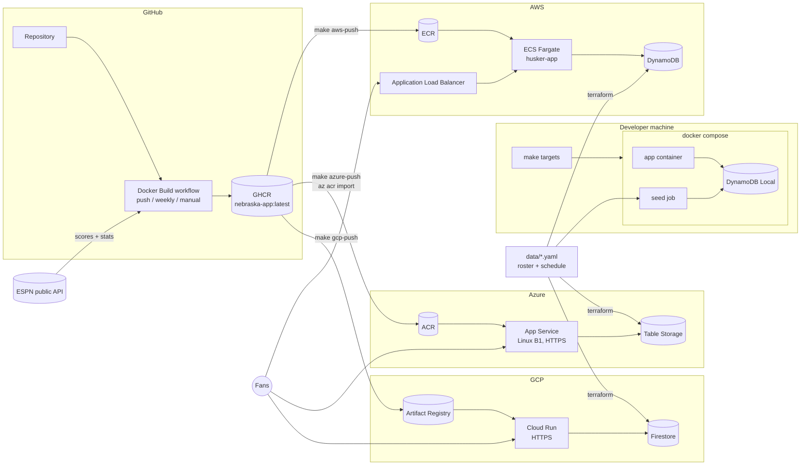
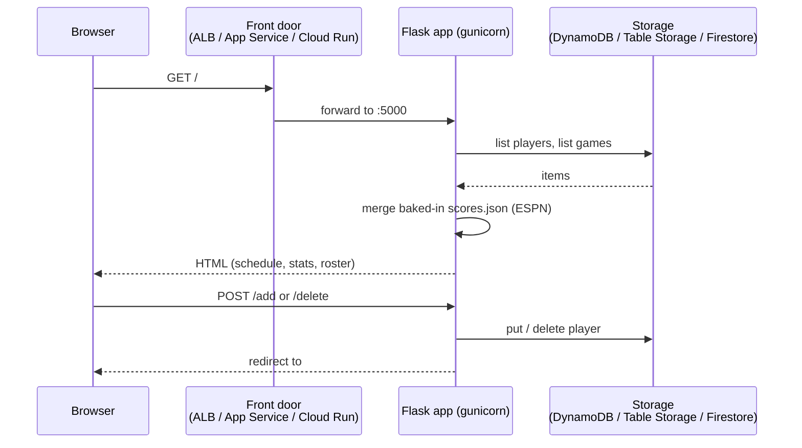
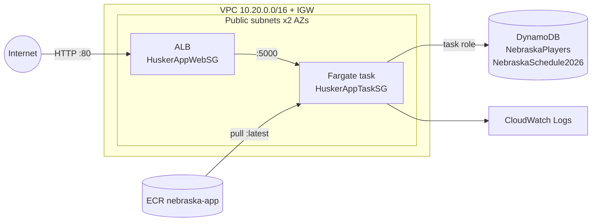
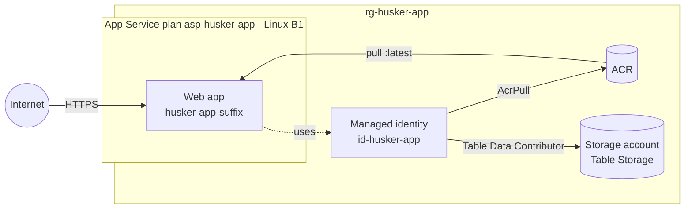
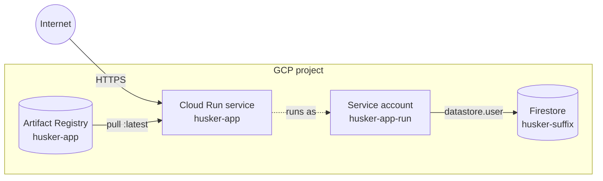

# Nebraska App

Husker football roster and schedule app (Flask), packaged as a container and deployable locally, to AWS, Azure, or GCP.

## TL;DR

```bash
make setup-check                 # check tools/logins; prints fix commands

# Local (no cloud account needed)
make local-up                    # http://localhost:8080
make local-down

# Cloud - pick one; each prints the app URL when done
make aws-deploy                  # ECS Fargate + DynamoDB      (AWS SSO profile, default: master)
make azure-deploy                # App Service + Table Storage (active az subscription)
make gcp-deploy                  # Cloud Run + Firestore       (active gcloud project)

# After a new image is published (e.g. the weekly score refresh)
make <cloud>-push                # copy the latest GHCR image and roll it out

# Clean up
make <cloud>-destroy
```

- Every cloud deploys the same image, `ghcr.io/kclinden/nebraska-app:latest`, built by GitHub Actions. Merge to `main` and let the **Docker Build** workflow finish before deploying app changes.
- Deploys need Terraform >= 1.6 and the cloud's CLI; AWS and GCP also need Docker to copy the image.
- Terraform state is local per cloud (`terraform/<cloud>/terraform.tfstate`). Run `make <cloud>-destroy` from the same machine when you're done.
- Running cost while deployed: AWS (ALB + Fargate) and Azure (B1 plan) bill continuously; GCP Cloud Run scales to zero.
- Add `VERBOSE=1` to any target for Terraform `INFO` logs and verbose `az`/`gcloud` output.

## Overview

This is an intentionally vulnerable security-testing application, not a production service. Use synthetic data and disposable accounts in isolated projects/subscriptions. API authorization findings are always enabled; there is no demo-mode switch. Public deployments combined with the deliberately broad cloud storage roles can expose resources outside this application.



- **Schedule (default tab)**: 2026 games with date, opponent, location, and home/away. Completed games show the final score and a **Stats** button that expands team stats (yards, first downs, 3rd-down efficiency, turnovers, penalties, possession) and Husker passing/rushing/receiving leaders.
- **Roster**: public read-only players sorted by jersey number. Login at `/admin` to manage the roster; administrators also manage accounts at `/admin/users`.
- **Program Legacy**: national/conference titles, Heisman winners, all-time wins, and the sellout streak, next to a Memorial Stadium photo.
- **Play Hail Varsity**: plays the fight song in the browser (Web Audio).

Scores and stats come from ESPN and are baked into the image at build time; the weekly GitHub Actions build refreshes them after each game. Roster and schedule live in DynamoDB (AWS/local), Azure Table Storage, or Firestore (GCP).

## Getting Started

```bash
make setup-check   # verify tools and logins; prints fix commands for anything missing
make local-up      # http://localhost:8080
```

Local Docker and Helm seed `admin` / `local-admin-password` and `viewer` / `local-viewer-password` on the first admin/API request. These are disposable local-only defaults. Bootstrap passwords are hashed in `NebraskaUsers`; re-seeding or redeploying does not reset existing accounts.

## Admin and API

`/admin/login` uses password-hashed database accounts and signed Flask sessions. HTML roster writes and account management enforce the admin role and CSRF tokens. Admins can create users, change roles, disable accounts, and reset passwords (minimum 12 characters for managed accounts). A reset or management change invalidates existing sessions for that account. Disabled users cannot log in.

Accounts and synthetic reports persist in DynamoDB's `NebraskaUsers`, Azure's `NebraskaUsers` table, or Firestore's `NebraskaUsers` collection. Local DynamoDB is still in-memory: a database pod/container restart loses these accounts. Cloud data survives app restarts but is deleted with the database on teardown.

### Credentials

Required environment variables are `SESSION_SECRET`, `ADMIN_PASSWORD`, and `VIEWER_PASSWORD`. Without them, admin/API routes return 503; the public page and static-image health probes still work. None is baked into the image. Keep the signing key stable across workers and restarts.

- Compose: override the defaults through environment variables or an ignored `.env` file.
- Helm: set `auth.existingSecret` to a Kubernetes Secret containing the three keys, or override `auth.sessionSecret`, `auth.adminPassword`, and `auth.viewerPassword`. Helm release values and Kubernetes Secrets need appropriate access controls.
- Terraform: each cloud generates three stable random secrets. AWS uses Secrets Manager and ECS secret injection; Azure uses protected App Service application settings; GCP uses Secret Manager references. Passwords and signing keys also exist in local Terraform state, so protect that file. `VERBOSE=1` provider logging can include sensitive data; do not share those logs.
- To retrieve generated cloud bootstrap passwords explicitly, run `terraform -chdir=terraform/<cloud> output -json bootstrap_passwords`. Do not paste the output into tickets or scanner reports. Use the admin UI for subsequent password resets; changing a bootstrap secret does not reset an existing account.
- Azure/GCP use Secure session cookies over HTTPS. Local HTTP and the current HTTP-only AWS ALB use non-Secure cookies; add TLS and set `SESSION_COOKIE_SECURE=true` before transmitting non-disposable credentials.

Existing deployments need `make <cloud>-deploy` to provision account storage/secrets, not only `*-push`. Let the new image build finish before that deployment.

### API Discovery

The OpenAPI 3.0 specification is served at `/openapi.json`. Public endpoints list games and players; writes and user/report endpoints require a session. JSON scanner login flow:

1. `GET /api/v1/session`, retaining the session cookie and the returned `csrf_token`.
2. `POST /api/v1/session` with JSON `{"username":"viewer","password":"..."}` and an `X-CSRF-Token` header containing that token.
3. Retain the authenticated session cookie for subsequent requests. The response includes a new token for `DELETE /api/v1/session` (logout).

| Endpoint | Methods | Purpose |
| --- | --- | --- |
| `/api/v1/games` | GET | Schedule |
| `/api/v1/games/{id}/stats` | GET | Baked-in game stats |
| `/api/v1/players` | GET, POST | Name search (`q`) and player creation |
| `/api/v1/players/{id}` | PATCH, DELETE | Update position or remove a player (use Id returned by GET) |
| `/api/v1/users/me` | GET, PATCH | Account profile and synthetic metadata |
| `/api/v1/reports` | GET | Current user's reports |
| `/api/v1/reports/{id}` | GET | Private report lookup |

### Expected Findings

| Scenario | Reproduction with a viewer session | Expected result |
| --- | --- | --- |
| Broken function-level authorization (API5) | POST/PATCH/DELETE a player | Succeeds without admin role; HTML admin writes are restricted |
| Broken object-level authorization (API1) | GET `/api/v1/reports/report-admin` | Returns another user's synthetic private report |
| Mass assignment (API3) | PATCH `/api/v1/users/me` with `{"Role":"admin"}` | Viewer becomes admin and can access `/admin/users` |
| Excessive data exposure (API3) | GET `/api/v1/users/me` | Includes `InternalNote` and `Department`; never password hashes or signing keys |
| Missing rate limits / unbounded lists (API4) | Inspect session/login and list routes | No application throttling or pagination limits |

Mutating API routes deliberately lack CSRF protection (unlike the HTML forms and session-login endpoint). Use these cases only against this owned lab. Reset promoted users using a separate administrator session or reset disposable local data.

Focused checks: `docker build -t nebraska-app:test ./app` then `docker run --rm -v "$PWD/tests:/tests:ro" --entrypoint python nebraska-app:test -m unittest discover -s /tests -v`. CI runs the same tests before building published images.

`make setup-check` (or `scripts/check_setup.sh [local] [aws] [azure] [gcp]`) checks git, make, curl, Python, Docker (daemon, `linux/amd64` builds, Compose), ESPN reachability, Terraform >= 1.6, AWS CLI v2 with the SSO profile and session, Azure CLI and login, gcloud with login, Application Default Credentials, and project, and the GitHub CLI. It exits non-zero if a required tool is missing.

## Architecture

One container image runs everywhere; only the data backend changes, selected by `STORAGE_BACKEND` in `app/storage.py`.



### Request flow



### Components

| Component | Local | AWS | Azure | GCP |
| --- | --- | --- | --- | --- |
| Container runtime | Docker Compose | ECS Fargate (0.25 vCPU / 512 MB) | App Service, Linux B1 plan (1 vCPU / 1.75 GB) | Cloud Run (1 vCPU / 512 MiB, scales 0-1) |
| Ingress | `localhost:8080` | ALB, HTTP :80 | Managed HTTPS ingress | Managed HTTPS (`*.run.app`) |
| Image source | Local build | ECR (copied from GHCR) | ACR (imported from GHCR) | Artifact Registry (copied from GHCR) |
| Data | DynamoDB Local (in-memory) | DynamoDB | Table Storage | Firestore (Native mode) |
| App identity | Dummy keys | ECS task role | User-assigned managed identity | Service account `husker-app-run` |
| Network | Compose network | VPC, 2 public subnets, IGW | App Service multi-tenant front end | Cloud Run managed |
| Logs | `docker compose logs` | CloudWatch `/ecs/husker-app` | App Service log stream (`make azure-logs`) | Cloud Logging (`make gcp-logs`) |
| Infra code | `docker-compose.yml` | `terraform/aws` | `terraform/azure` | `terraform/gcp` |

GitHub Actions only builds and publishes to GHCR; it has no cloud credentials. Deployments are pulled into each cloud by `make aws-deploy` / `make azure-deploy` / `make gcp-deploy` (and `*-push` for updates), so the build never depends on the state of any cloud.

## Repository Layout

- `app/` application source, `Dockerfile`, and related assets; `storage.py` selects DynamoDB, Azure Table Storage, or Firestore via `STORAGE_BACKEND`
- `data/` roster and schedule YAML, shared by local seeding and every cloud stack
- `scripts/` developer setup check, score fetcher, and DynamoDB Local seeder
- `docs/` README assets (app screenshot)
- `terraform/aws/` AWS stack (VPC, ECS Fargate, ALB, ECR, DynamoDB, IAM)
- `terraform/azure/` Azure stack (App Service, ACR, Table Storage, managed identity)
- `terraform/gcp/` GCP stack (Cloud Run, Artifact Registry, Firestore, service account)
- `docker-compose.yml` local test stack
- `Makefile` shortcuts for local, AWS, Azure, and GCP workflows (run `make help`)

## Make Targets

| Target | Description |
| --- | --- |
| `make setup-check` | Check required tools and logins, with fix suggestions (`SECTIONS="local gcp"` to limit) |
| `make local-up` | Fetch scores, build, and start the local stack at http://localhost:8080 |
| `make local-down` | Stop the local stack |
| `make local-restart` | Rebuild and restart with fresh data |
| `make local-logs` | Tail container logs |
| `make local-reseed` | Re-run the DynamoDB Local seeder |
| `make scores` | Refresh `app/scores.json` from ESPN |
| `make aws-login` | Ensure an AWS SSO session is active (runs `aws sso login` if expired) |
| `make aws-plan` | `fmt`, `validate`, and `plan` |
| `make aws-deploy` | Create/update the full stack, copy the GHCR image to ECR, and roll out ECS |
| `make aws-push` | Copy the latest GHCR image to ECR and roll out ECS |
| `make aws-image-local` | Build from your working copy and push to ECR (then `make aws-redeploy`) |
| `make aws-redeploy` | Force a new ECS deployment on the current `:latest` image and show rollout progress until stable |
| `make aws-url` | Print the app URL |
| `make aws-logs` | Tail the app's CloudWatch logs |
| `make aws-destroy` | Destroy all AWS resources |
| `make azure-login` | Ensure the Azure CLI has a valid login (runs `az login` if not) |
| `make azure-plan` | Register providers, `fmt`, `validate`, and `plan` |
| `make azure-deploy` | Create/update the full stack, import the GHCR image into ACR, deploy the web app, and wait for HTTP 200 |
| `make azure-push` | Import the latest GHCR image into ACR and restart the web app |
| `make azure-image-local` | Build from your working copy in ACR (then `make azure-redeploy`) |
| `make azure-redeploy` | Restart the web app so it re-pulls `:latest`, then wait for HTTP 200 |
| `make azure-status` | Show the web app's state, host name, and image |
| `make azure-url` | Print the app URL |
| `make azure-logs` | Stream the web app's container logs |
| `make azure-destroy` | Destroy all Azure resources |
| `make gcp-login` | Ensure gcloud and Application Default Credentials are logged in; show the project |
| `make gcp-plan` | Enable APIs, `fmt`, `validate`, and `plan` |
| `make gcp-deploy` | Create/update the full stack, copy the GHCR image to Artifact Registry, deploy Cloud Run, and wait for HTTP 200 |
| `make gcp-push` | Copy the latest GHCR image to Artifact Registry and deploy a new revision |
| `make gcp-image-local` | Build from your working copy and push to Artifact Registry (then `make gcp-redeploy`) |
| `make gcp-redeploy` | Deploy a new Cloud Run revision from `:latest`, then wait for HTTP 200 |
| `make gcp-status` | Show the ready revision, image, and URL |
| `make gcp-url` | Print the app URL |
| `make gcp-logs` | Show recent Cloud Run logs |
| `make gcp-destroy` | Destroy all GCP resources |

## Local Testing (Docker)

Requires Docker and Python 3. No AWS account or credentials needed.

```bash
make local-up     # http://localhost:8080
make local-down
```

`docker-compose.yml` runs three services:

- `dynamodb-local` - [Amazon DynamoDB Local](https://hub.docker.com/r/amazon/dynamodb-local), in-memory, exposed on `localhost:8000`.
- `seed` - runs `scripts/seed_local_dynamodb.py` to create the `NebraskaPlayers` and `NebraskaSchedule2026` tables and load `data/roster.yaml` and `data/schedule.yaml`.
- `app` - the app image, started after seeding succeeds.

The app needs no code changes to run locally: boto3 honors `AWS_ENDPOINT_URL_DYNAMODB`, which compose points at `dynamodb-local`. Credentials are dummy values. Data is reset every time the stack stops; roster add/remove changes are not persisted.

To inspect the local tables from your machine:

```bash
AWS_ACCESS_KEY_ID=local AWS_SECRET_ACCESS_KEY=local \
  aws dynamodb scan --table-name NebraskaSchedule2026 --endpoint-url http://localhost:8000 --region us-east-1
```

## Scores and Game Stats

`scripts/update_scores.py` pulls final scores, team stats, and Husker leaders for completed games from ESPN's public API and writes `app/scores.json` (gitignored, generated at build time). Set `SEASON=2025` to fetch a different season. Without the file the app still runs; scores just show `-`. `make scores` keeps the existing file if ESPN is unreachable.

## AWS Deploy

Requires the AWS CLI with an SSO profile, Terraform >= 1.6, and Docker. All `aws-*` targets first run `make aws-login`, which opens `aws sso login` if the session has expired. The profile defaults to `master`; override with `AWS_PROFILE=member`. Region defaults to `us-east-1`; override with `AWS_REGION=us-west-2`.

```bash
make aws-plan
make aws-deploy      # prints the load balancer URL when done
make aws-destroy     # tear everything down
```

The stack deploys into a blank account/region; it creates its own networking and needs nothing pre-existing.

`make aws-deploy` runs in this order so the service never starts without an image:

1. Create the ECR repository (targeted apply).
2. Pull `ghcr.io/kclinden/nebraska-app:latest` (published by the Docker Build workflow) and push it to ECR as `:latest`. Use `GHCR_TAG=sha-<full-commit>` to deploy a specific build.
3. Apply the rest of the stack.
4. Force a new ECS deployment and wait for it to become stable.

To roll out a newer GHCR build later (e.g. after the weekly score refresh), run `make aws-push`. To test uncommitted changes, run `make aws-image-local aws-redeploy`.

### State

Terraform uses **local state** in `terraform/aws/terraform.tfstate` (gitignored). There is no remote backend; keep the file on the machine that deploys, or run `make aws-destroy` before deleting it.

### AWS Resources



- **Network** (`network.tf`): VPC (`10.20.0.0/16` by default, `vpc_cidr`), internet gateway, and two public `/24` subnets in the first two AZs with a default route to the IGW. No NAT gateway.
- **Compute** (`ecs.tf`): ECS Fargate service `husker-app` (1 task, 0.25 vCPU / 512 MB) running `nebraska-app:latest` from ECR, with deployment circuit breaker and rollback. Tasks get a public IP for outbound access; their security group only admits the ALB on port 5000.
- **Load balancer**: internet-facing ALB on port 80 across both public subnets.
- **Data** (`db.tf`): DynamoDB tables `NebraskaPlayers` and `NebraskaSchedule2026`, seeded from `data/*.yaml`.
- **IAM** (`iam.tf`): task execution role (pull image, write logs), task role (DynamoDB read/write + `S3OverlyPermissivePolicy`).
- **Logs**: CloudWatch `/ecs/husker-app` (30-day retention).

## Azure Deploy

Requires the Azure CLI and Terraform >= 1.6 (no local Docker needed). All `azure-*` targets first run `make azure-login`, which opens `az login` if there's no valid token. The active `az account` subscription is used (`az account set --subscription ...` to change it). You need Owner (or Contributor + User Access Administrator) because the stack creates role assignments.

```bash
make azure-plan
make azure-deploy    # prints the https:// app URL when done
make azure-destroy   # tear everything down
```

`make azure-deploy`:

1. Registers the needed resource providers (`Microsoft.Web`, `ContainerRegistry`, `ManagedIdentity`, `Storage`).
2. Creates the resource group and ACR (targeted apply).
3. Imports `ghcr.io/kclinden/nebraska-app:latest` into ACR with `az acr import` (`GHCR_TAG=...` for a specific build).
4. Applies the rest of the stack, then waits for the URL to return HTTP 200 (the first start pulls the image, so allow a minute or two).

To roll out a newer GHCR build later, run `make azure-push`. App Service pulls the image again when the app restarts, so `azure-redeploy` restarts it and polls the URL until it returns 200. The app service plan is billed while it exists (B1 is roughly $13/month); `make azure-destroy` removes it. Override the tier with `TF_VAR_app_service_sku=B2`.

State is local in `terraform/azure/terraform.tfstate` (gitignored). Region defaults to `centralus` (`TF_VAR_location=eastus` to override).

### Azure Resources



- **Compute** (`appservice.tf`): Linux App Service plan (`B1` by default, `app_service_sku`) and web app `husker-app-<suffix>` running `nebraska-app:latest` from ACR (Basic, admin user disabled), pulled with the managed identity. HTTPS only, TLS 1.2+, FTP/Web Deploy basic auth disabled, Always On, and a health check on `/nebraska_football.png`. `WEBSITES_PORT=5000` routes traffic to gunicorn.
- **Data** (`storage.tf`): Storage account with tables `NebraskaPlayers` (PartitionKey = jersey, RowKey = SHA-1 of the name) and `NebraskaSchedule2026` (PartitionKey = `2026`, RowKey = game id), seeded from `data/*.yaml`. The app uses `STORAGE_BACKEND=azure_table` and authenticates with the managed identity (no keys).
- **Identity** (`iam.tf`): user-assigned managed identity with `AcrPull` on the registry, `Storage Table Data Contributor` on the storage account, and an intentionally overly permissive `Storage Blob Data Owner` at subscription scope (mirrors the AWS `S3OverlyPermissivePolicy`).
- **Logs**: container stdout/stderr and HTTP logs on the App Service file system (7-day retention), streamed with `make azure-logs`.

## GCP Deploy

Requires the Google Cloud CLI, Terraform >= 1.6, and Docker. All `gcp-*` targets first run `make gcp-login`, which runs `gcloud auth login` and `gcloud auth application-default login` (Terraform uses Application Default Credentials) if needed. The active gcloud project is used (`gcloud config set project <id>` to change it); region defaults to `us-central1` (`GCP_REGION=...` to override).

```bash
make gcp-plan
make gcp-deploy      # prints the https://...run.app URL when done
make gcp-destroy     # tear everything down
```

`make gcp-deploy`:

1. Enables the needed APIs (`run`, `artifactregistry`, `firestore`, `iam`).
2. Creates the Artifact Registry repository (targeted apply).
3. Pulls `ghcr.io/kclinden/nebraska-app:latest` and pushes it to Artifact Registry (`GHCR_TAG=...` for a specific build).
4. Applies the rest of the stack, then waits for the URL to return HTTP 200.

To roll out a newer GHCR build later, run `make gcp-push`; `gcp-redeploy` runs `gcloud run deploy` with the same `:latest` tag, which resolves the new digest and creates a new revision. Cloud Run scales to zero when idle, so the first request after a while includes a short cold start.

State is local in `terraform/gcp/terraform.tfstate` (gitignored).

### GCP Resources



- **Compute** (`cloudrun.tf`): Cloud Run v2 service `husker-app` (1 vCPU / 512 MiB, 0-1 instances) running `nebraska-app:latest` from Artifact Registry on port 5000. Public via `invoker_iam_disabled` (no `allUsers` binding, which domain-restricted sharing policies often block).
- **Data** (`firestore.tf`): Firestore Native database `husker-<suffix>` (deletion protection off so destroy works) with collections `NebraskaPlayers` (document id = `<jersey>-<SHA-1 of name>`) and `NebraskaSchedule2026` (document id = game id), seeded from `data/*.yaml`. The app uses `STORAGE_BACKEND=firestore`.
- **Identity** (`iam.tf`): service account `husker-app-run` with `roles/datastore.user`, plus an intentionally overly permissive project-level `roles/storage.admin` (mirrors the AWS `S3OverlyPermissivePolicy`).
- **Logs**: Cloud Logging; `make gcp-logs` shows recent entries.

## Container Image (GitHub Actions)

`.github/workflows/docker-build.yml` refreshes scores, builds the image from `app/`, and pushes it to `ghcr.io/<owner>/<repo>`. It has no cloud dependency:

- on pushes to `main` touching `app/` or `scripts/` (tags `latest` and `sha-<commit>`)
- every Sunday 12:00 UTC during the season (Aug-Jan) to pick up the weekend's game (adds a `YYYYMMDD` tag)
- manually via **Run workflow**
- on pull requests: builds without pushing and runs a container smoke test

GitHub Actions does not deploy to any cloud; `make aws-push` / `make azure-push` / `make gcp-push` copy the published image into ECR / ACR / Artifact Registry.

## Troubleshooting

| Symptom | Cause / fix |
| --- | --- |
| `HTTP response was nil; connection may have been reset` while creating table entries or documents | Dropped connections from the local network (not throttling). Re-run `make <cloud>-deploy`; Terraform retries only what failed. |
| GCP `403 ... permission denied` from Terraform but the console works | Terraform uses Application Default Credentials, which may belong to a different account than `gcloud`. Run `gcloud auth application-default login` as the project account. |
| `Error connecting to the database` right after a deploy | New role assignments can take a few minutes to apply (Azure especially). Wait and refresh; check `make <cloud>-logs`. |
| Page shows `-` for every score | `app/scores.json` was missing when the image was built (ESPN unreachable). Re-run the Docker Build workflow, then `make <cloud>-push`. |
| Azure `terraform destroy` waits a long time | Deleting a resource group's resources can take several minutes; if it errors, run `make azure-destroy` again, or `az group delete -n rg-husker-app --yes` and remove `terraform/azure/terraform.tfstate*`. |

## Notes

- Terraform state files are intentionally ignored by git.
- CI validates `terraform/aws`, `terraform/azure`, and `terraform/gcp` formatting and configuration on push and pull requests.
- Each cloud stack intentionally grants the app an overly permissive storage role (AWS `S3OverlyPermissivePolicy`, Azure `Storage Blob Data Owner` at subscription scope, GCP `roles/storage.admin`) for security-scanner demos. Remove it from `iam.tf` for least privilege.
